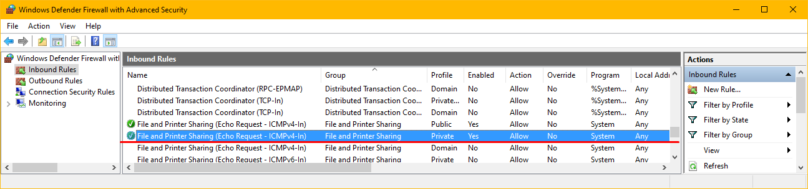
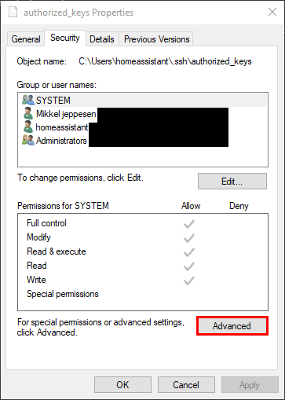
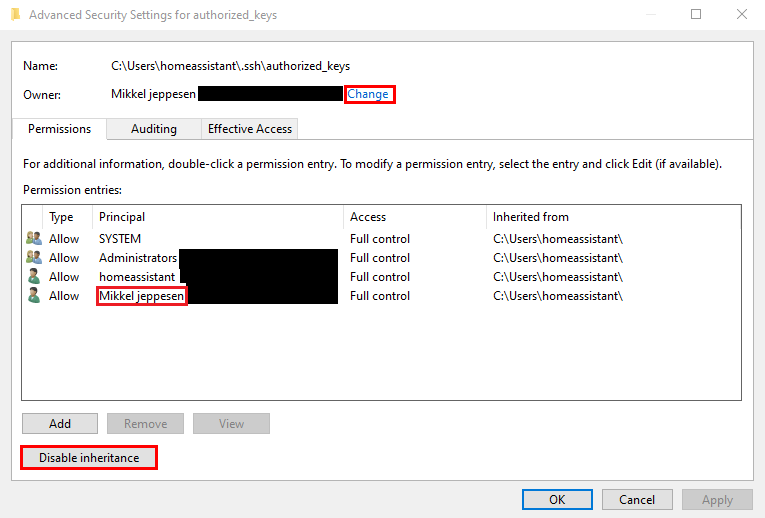

# Windows 10 Home Assistant power management
*First off, this blog post is heavily inspired / dependent on other blog posts. It is particularly 
inspired by [this](https://blog.schembri.me/post/powering-a-windows-pc-via-homeassistant/) blog post
however solves issues I ran into following other posts.*

> After posting this blog post, I was made aware of a tool called [IOT Link](https://gitlab.com/iotlink/iotlink/-/wikis/home) which seems to be a neat alternative. I'd recommend looking at / trying this before bothering with the annoyance that is ssh on windows. Thanks to Luma on the homeassistant discord! :)

I wanted to be able to, lazily from my bed, turn on/off my desktop PC. Having recent set up
home assistant, the logical approach was to integrate it into there. I already had my computer 
set up for Wake on LAN support, and used a separate app for this, but this will only allow you to 
turn on your PC, which is only half of the task, however it was also by far the easiest, so lets 
start with that's


# **1** Turning on your PC with Wake on LAN

Before you even start trying to use the Home Assistant WoL integration, you first have to ensure
that your PC is configured to accept WoL packets. This varies a lot from motherboard to motherboard
(or network interface to network interface) so I won't detail that here. Googling 
"Wake on LAN \<motherboard name\>" should get you to a solution. 
## As an example:
On my Asus motherboard the setting was in: `Advanced -> APM Configuration -> Power On By PCI-E/PCI`
which could be confusing, as there's no mention of WoL there, however as the network cards are 
connected over PCI-E, this is the setting to enable on those boards.

Once you've got WoL working, adding the
[Home Assistant WoL integration](https://www.home-assistant.io/integrations/wake_on_lan/) 
is easy as pie. Just set up a switch with the *wake_on_lan* platform like this:

```yaml
switch:
  - platform: wake_on_lan
    mac: "xx:xx:xx:xx:xx:xx"
    name: Desktop
    host: 10.0.0.5
```

The name and host is optional, however they're nice to have. The name just gives it a name of your 
choice, while setting the host to the IP of your computer allows home-assistant to ping it to 
check if it is on. There's some issues with that on windows 10, that I'll cover later in this post.

## Getting the MAC address
For the integration to work, you have to put in the MAC address of the NIC in your desktop. 
You can find this in a number of different ways, but my preferred way is probably to run this 
one-liner in PowerShell:

```powershell
Get-WmiObject win32_networkadapterconfiguration | Where-Object IPAddress | select description, macaddress, IPAddress
```

This will spit out a list of all your different network interfaces that have an IPAddress, along
with a description and the MAC address of that NIC. This is what that looks like on my PC, with the 
addresses sorta somewhat censored.

```
description                         macaddress        IPAddress
-----------                         ----------        ---------
Realtek PCIe GbE Family Controller  xx:xx:xx:xx:xx:xx {10.0.0.5, ffff::ffff::ffff::ffff::ffff}
Hyper-V Virtual Ethernet Adapter    FF:FF:FF:FF:FF:FF {172.28.240.1, ffff::ffff::ffff::ffff::ffff}
Npcap Loopback Adapter              FF:FF:FF:FF:FF:FF {169.254.255.141, ffff::ffff::ffff::ffff::ffff}
Hyper-V Virtual Ethernet Adapter #2 FF:FF:FF:FF:FF:FF {172.21.224.1, ffff::ffff::ffff::ffff::ffff}
```

In my case I know that my onboard interface is the Realtek controller, while the others are for 
the virtual machine host software, so I grabbed the MAC address and IP from there.

## Allowing PING echo requests through the W10 firewall
Once you've got that set up, you may run into an issue where the UI in Home Assistant always thinks
your desktop is off. I ran in to that issue, and it turns out in more recent versions 
(well not that recent... in 2020) of windows, the firewall was changed to not respond to PING 
requests. To fix this such that Home Assistant can see that the PC is on, open the
*Windows Defender Firewall with Advanced Security* program (what a name). Either search for it 
or hit `win + r` and run `WF.msc`  
Go to *Inbound Rules* and find `File and Printer Sharing (Echo Request - ICMPv4-In)` and enable it.
There's several different versions of these rules. Enable the ones relevant to your computer.
that'll likely be the rule for the *private* or *public* profile 


If you're having trouble with this step, then there's a more detailed guide [here](https://www.faqforge.com/windows/windows-10/how-to-allow-ping-trough-the-firewall-in-windows-10/)

With this configured, turning *ON* the PC should be working. The next "fun" step is to set up a 
method of turning off the computer. 


# 2 Turning off the PC - SSH
While there is an RPC Shutdown plugin for Home Assistant , I didn't have much luck with it. It seems
services and settings required for it to work have been disabled / locked down for security reasons,
and I didn't feel like digging too much into this.

## Installing OpenSSH server on windows 10
Instead I decided, to go for SSH, as I'm familiar with it and it happens to be very portable, with
just the shutdown command (and some permissions) being different between platforms. You can also 
run different commands if you don't actually want to shut down the PC

The initial steps are very similar to what is described in the [first mentioned blog-post](https://blog.schembri.me/post/powering-a-windows-pc-via-homeassistant/#installing-the-openssh-server) however we
want to install the server, not the client, so we'll run the following in an admin PowerShell:

```powershell
# Install the OpenSSH server
Add-WindowsCapability -Online -Name OpenSSH.Server~~~~0.0.1.0
Start-Service sshd
# OPTIONAL but recommended:
Set-Service -Name sshd -StartupType 'Automatic'
# Confirm the Firewall rule is configured. It should be created automatically by setup. 
Get-NetFirewallRule -Name *ssh*
# There should be a firewall rule named "OpenSSH-Server-In-TCP", which should be enabled
# If the firewall does not exist, create one
New-NetFirewallRule -Name sshd -DisplayName 'OpenSSH Server (sshd)' -Enabled True -Direction Inbound -Protocol TCP -Action Allow -LocalPort 22
```

It's almost identical to the linked post, but installs the server instead of the client. I'll also
link to [the great Microsoft documentation](https://docs.microsoft.com/en-us/windows-server/administration/openssh/openssh_install_firstuse) that the other blog links to.

## Creating a local user
Next I'd recommend creating a dedicated Home Assistant user on the PC, as I don't think it'd be a 
great idea to give your Home Assistant instance unlimited access to your main account. Again the commands
are lifted and modified from the same blog:

```powershell
$Password = Read-Host -AsSecureString
New-LocalUser "homeassistant" -Password $Password 
```

then, to allow your Home Assistant instance to connect to this user without a password, we need to set up
key login. SSH into your Home Assistant instance, and generate a key. In order to ensure the key is persisted,
put it in a persistent folder like `/config` or `/ssl`.

logged in to your Home Assistant instance over SSH, run the following command to generate a new key:
```bash
ssh-keygen -t ed25519 -f "/ssl/.ssh/id_ed25519"
```
Follow the prompts but leave the password empty.
This will generate a modern elliptic curve based key, and put in in the `/ssl/.ssh` directory.
Next you'll have to allow this key to connect to the Home Assistant user on your W10 PC. Run:
```bash
cat /ssl/.ssh/id_ed25519.pub
```
and copy the output, this is the public key that we'll want to tell windows is allowed access.
Open a text editor and paste this public key into it, and save it as `C:\Users\homeassistant\authorized_keys`

This should be all that's needed, but the SSH server on windows refuses to accept authorized_keys files
that have the default file permissions, so we'll have to fix that.  
Right-click the file and open it's properties, go to *Security* and click *advanced*  


1) Disable inheritance at the bottom and convert to explicit permissions
1) Change the owner to Home Assistant at the top, click change and enter `homeassistant` in the box
1) Remove your main account from the list of permission entries

Only the user that is being logged in to, SYSTEM, and Administrators should be on the list of users / groups for this file, so remove your main account 



Once this is set up, we're almost there, however the Home Assistant account needs to have permissions to force a shutdown. If you have windows 10 *pro* or similar, this can be done via the Group Policy Editor easily.

Navigate to `Local Computer Policy -> Computer Configuration -> Windows Settings -> Security Settings -> User Rights Assignement` and find `Force Shutdown from a remote system` open it and add homeassistant to the list of users allowed to remotely shut down the PC.  
I'm not aware of a way to do this outside of the group policy editor, as I personally run W10 pro, but if someone finds a way, I'd very much appreciate the info, and add it to this post. Best place to tell me would
be to open an issue or PR on [the repository](https://github.com/Duckle29/blog) for this blog

# 3 Adding the turn off part to the Home Assistant switch
Now that all the pieces are in place, we just have to tell Home Assistant how to nicely ask the computer to 
turn off.

To do this, we'll add a `shell_command` alias to our config:

```yaml
shell_command:
  desktop_off: 'ssh -o StrictHostKeyChecking=no -o ServerAliveInterval=1 -o ServerAliveCountMax=1 -i /ssl/.ssh/id_ed25519 homeassistant@10.0.0.5 "shutdown /s /t 60 /c \"Home Assistant is shutting down the PC in 60 seconds. Run shutdown /a in a cmd if you want to abort it\""'
```

This is a fairly simple command. The different `-o` arguments are just some options that are needed as we're running this *headless*, the `-i` argument tells ssh where to find the private key to use to sign in with, and then `homeassistant@10.0.0.5` is the `user@desktop_ip` that you want it to connect to. The last part is the command we want to run on the remote system (the desktop), which in this case is the windows shutdown command, telling it to shut down after 60 seconds, and display a message informing anyone at the PC about what's going on.

After adding this to the `turn_off` key on your switch, you should be all set! :)

```yaml

shell_command:
  desktop_off: 'ssh -o StrictHostKeyChecking=no -o ServerAliveInterval=1 -o ServerAliveCountMax=1 -i /ssl/.ssh/id_ed25519 homeassistant@10.0.0.5 "shutdown /s /t 60 /c \"Home Assistant is shutting down the PC in 60 seconds. Run shutdown /a in a cmd if you want to abort it\""'

switch:
  - platform: wake_on_lan
    mac: "xx:xx:xx:xx:xx:xx"
    name: Desktop
    host: 10.0.0.5
    turn_off:
      service: shell_command.desktop_off
```

Phew, that was a bit of work.